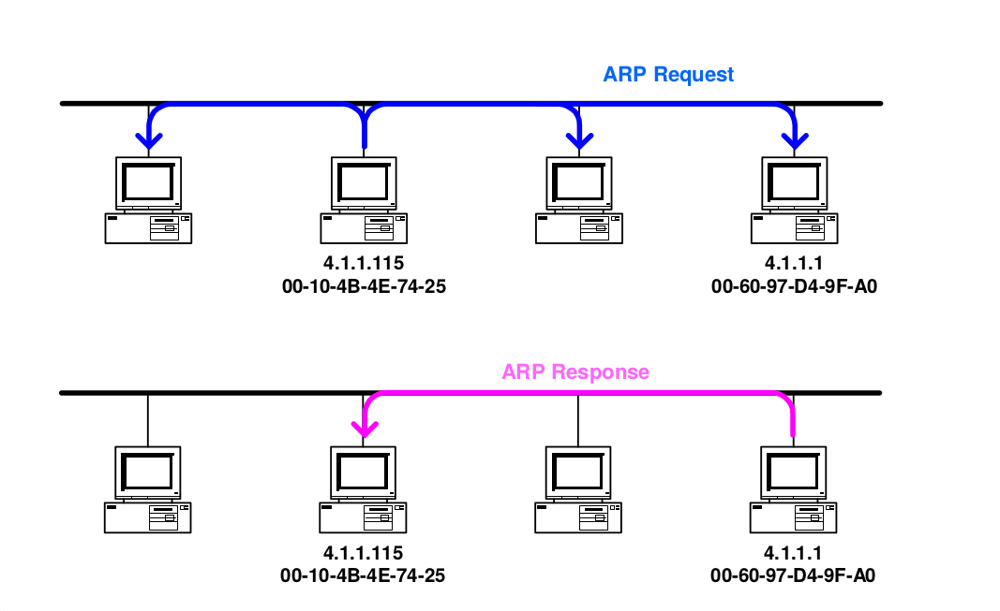

# ARP - Address Resolution Protocol

Objetivo do ARP:

- Descubrir se um terminal/router com um dado endereço de IP se encontra ligado na rede
- Permite a construção da frame de Ethernet com os endereços MAC de origem e destino corretos
	- Quando não sabe o endereço MAC do terminal/router de destino, envia um **ARP Request**
	- Se alguém na rede possuir na sua tabela de ARP, uma ligação entre o IP enviado no **ARP Request** e o MAC addres, envia uma **ARP Response** para o terminal/router que enviou o pedido, indicando o MAC address

		

- Um **ARP Request** é sempre `broadcast`
- É identificado com o `Protocol Type 800`
- É inserido numa frame de `Ethernet`

