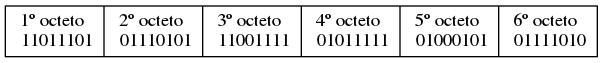
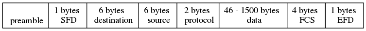
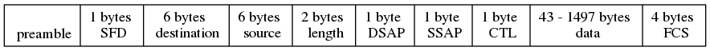
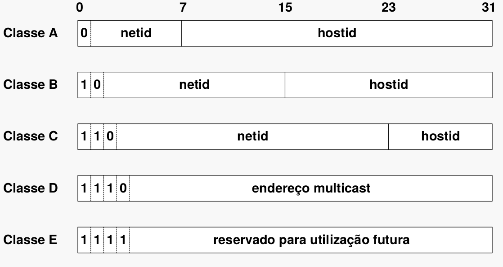
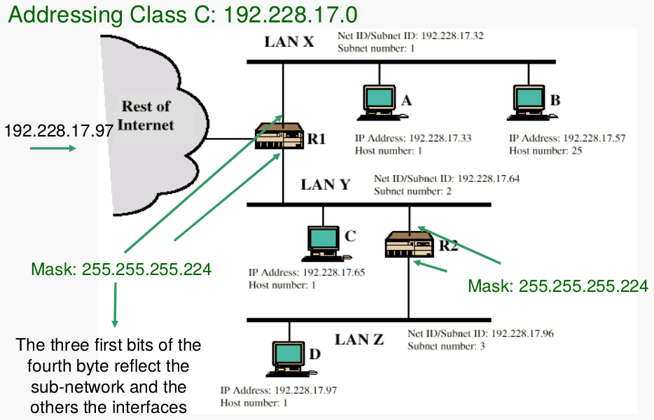

# Addressing
 
**OUI:** Organization Unique Identifier

- No 1º octeto, existem dois bits com significados especiais
	- **Último:** bit G/I (Grupo/Individual)
	- **Penúltimo:** bit G/L (Global/Local)

Tipos de Endereços:

- `Unicast`: G/I = 0
- `Multicast`: G/I = 1
- `Broadcast`: todos os bits a 1

# Packet Format
- 6 octetos
- **Preamble:** 
	- sequência alternada de '0's e '1's, para sincronização de clock
		- `01010101010101010101010...`
	- São usados códigos de Manchester diferenciais, que produzem exatamente a mesma sequência que os dados binários
	- A sincronização do clock é crucial para decidir o instante de amostragem
	- O objetivo da escolha do instante de amostragem ótimo é maximizar a abertura do diagrama de olho no instante de amostragem
	- O `preamble` ao 57 bits
		- No entanto, é preciso a indicação da terminação da trama, uma vez que estes bits apenas servem sincronismo, e "não podem ser contados antes de existir sincronismo"
- **SFD - Start of Frame Delimiter:** 
	- Para detetar o início da `frame`
	- **Pad:** bytes de _padding_ 
	- Para garantir a formatação correta do `frame` e alinhamento da informação
- **Source Address:**
- **Hardware Destination address**
- **FCS - Frame Check Sequence:**
	- Para a deteção de erros na transmissão
- **EFD - End of frame Delimiter:** 
	- Detetar o fim do `frame`
	- Possui um padrão específico
	- Utilizado porque não existe informação relativa ao tamanho do pacote na Ethernet II

## Ethernet II
- Existem dois tipos de _standards_ de Ethernet
- A proposta  original foi submetida pelo IEEE

O 3º campo no header (`protocol`) é superior a 1500 bytes e representa o protocolo à qual os dados pertencem.

## IEEE 802.3

Os primeiros três campos referem-se ao tamanho do pacote de dados (`MAC`), indicando no campo `length` o tamanho do campo de dados.
Os três próximos bits (`DSAP`, `SSAP` e `CTL`) referem-se à `LLC - Logical Link Control` _Protocol Layer_, e são usadas para representar o protocolo.

Uma das principais diferenças entre o protocolo Ethernet II e o protocolo IEEE 802.3 é que no IEEE 802.3 é feita explicitamente a identificação do protocolo. Entre o protocolo IEEE e Ethernet II existe uma identificação explicita na trama enviada. Além disso, o campo length (3º campo, possui dimensão inferior a 1500 bytes)

Contém ainda explicitamente:

- Designação do serviço de _access point_
- Quais são as "aplicações" da camada `Applications` que precisam do pacote
- _Control Data_
- _Frame Check Sequence_, com CRC (Cyclic Redudance Check)

# Protocol Demultiplexing
Usando o campo `protocol` de uma `frame` Ethernet, obtemos o diagrama de blocos representado abaixo, na figura \ref{fig:protocol_demux}

## Classes de IP address

| Class    | # bits in prefix | # max networks | # bits in suffix | #max hosts per network |
|:--------:|:---------:|:--------:|:--------:|:-----------:|
| A        |    7      |    128   |   24     |   16777216  |
| B        |    14     |  16384   |   16     |      65536  |
| C        |    21     | 2097152  |    8     |        256  |

: Características dos 3 principais tipos de endereçamento usados. Note que nem todos os potenciais endereços são usados

### Endereços IP especiais

### Classificação dos endereços nas classes

| Class    | Endereço mínimo possível | Endereço máximo possível |
|:--------:|:------------------------:|:------------------------:|
| A        |      1.0.0.0             |          126.0.0.0       |
| B        |    128.0.0.0             |        191.255.0.0       |
| C        |    192.0.0.0             |      223.255.255.0       |
| D        |    224.0.0.0             |    239.255.255.255       |
| E        |    240.0.0.0             |    255.255.255.254       |

## IP multicast
Define a chamada classe D

 `1110`.<group ID>

- Os pacotes são transmitidos a um grupo de máquinas, 
- Cada máquina pode estar em mais do que um grupo em simultâneo

**IGMP:** Internet Group Management Protocol

- Pode ser usado para efetuar a troca de informação entre os vários elementos/nós da rede	

- Preferencialmente, devo ser usado `multicast` se o hardware tiver suporte para o mesmo. Caso contrário, é preferível usar `broadcast`

## Máscaras de Rede
- As máscaras de rede são utilizadas para fazer `classless addresing`
- Inicialmente, os endereços IP serviam para **fixar e definir fronteiras** entre redes, usando os primeiros bits do campo de endereço, tal como no passado tinha sido feito para as classes A, B e C
- Mais tarde, as fronteiras entre redes passaram a ser variáveis
- Passou a ser usada uma máscara de rede para definir o que pertence ou não à rede, sendo usada para separar os endereços que pertencem à rede e os endereços que pertencem ao _host_
- É importante para definir aspetos como `broadcaste` e `multicast`

\begin{table}[]
\centering
\caption{My caption}
\label{my-label}
\begin{tabular}{llllll}
            & \multicolumn{2}{l}{decimal}       &  & \multicolumn{2}{l}{binário}  \\ \cline{2-3} \cline{5-6} 
				& rede                      & host  &  & rede                          & hots \\
endereço IP & \multicolumn{1}{l|}{10.}  & 0.0.1 &  & \multicolumn{1}{l|}{00001010} & 00000000 00000000 00000001 \\
máscara     & \multicolumn{1}{l|}{255.} & 0.0.0 &  & \multicolumn{1}{l|}{11111111} & 00000000 00000000 00000000 \\

\end{tabular}
\end{table}

## Subnetting

