# Hubs vs Switches

## Repeaters/Hubs
- Um repetidor numa rede de telecomunicações opera como um descodificador + amplificador
	- Descodifica a informação que lhe chega
		- Amostra
		- Quantifica
		- Converte de analógico para digital
	- Amplifica
		- Amplifica a potência do sinal
		- transmite
- Opera na **1ª  camada**, **bit a bit**
- Unidade de operação/trabalho: bit
- Implica que o meio só possa ser **usado** por uma estação de cada vez
- Interligam segmentos do mesmo tipo de LANs, i.e., interligam diferentes segmentos da mesma LAN
- A largura de banda agregada é limitada pela taxa de transmissão da LAN
- Os bits vão sendo transmitidos à medida que vão chegando
- A bitrate é partilhada globalmente
- Opera no nível físico
- Regenera os sinais
- Um `hub` é um repetidor com múltiplas portas
- Pode fazer a conversão entre meios físicos de propagação do sinal
	- e.g., elétrico <-> ótico

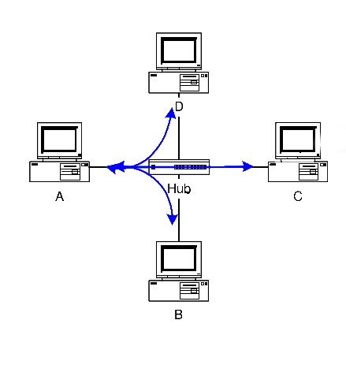

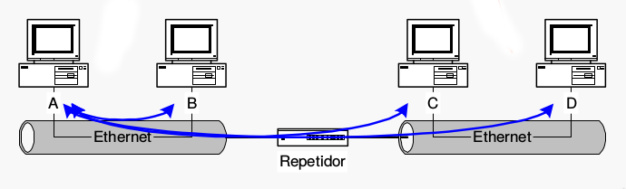

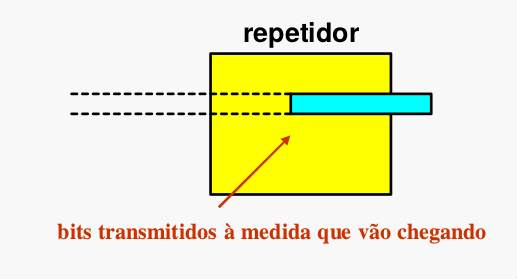

## Bridges/Switches
- Analiso o pacote quando chega
	- Tomo decisões com base no destinatário
		- Se o destinatário está na mesma porta que o emissor, não envio o pacote para mais nenhuma porta
		- Se o destinatário esta na porta x, que não coincide com a mesma porta que o emissor, envio para apenas para a porta x
	- método de `Store and Forwarding` + `Filtering` aos pacotes
		- Selectividade da porta de destino
		- Permite que as portas operem a diferentes taxas de transmissão
		- Não envia os pacotes para uma porta se não precisar de o fazer
- Unidade de operação/trabalho: pacote
- Interligam diferentes `LANs`
- Mais complexos que os `repeaters`/`hubs`
- Um switch é uma `bridge` _multiple port_  
- Um switch possui a noção de estados
- Tipo `store-and-forward`
- Opera ao nível da camada da ligação (camada 2)
- Interliga dois ou mais domínios de colisões
- Comuta com base nos endereços MAC

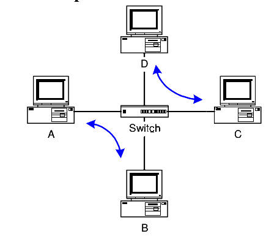

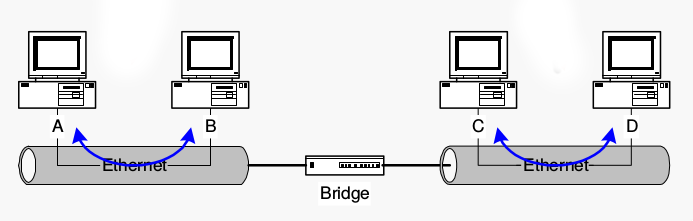

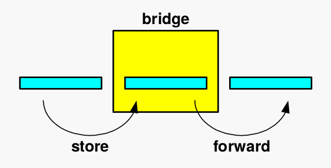

## Bridges/switches vs repeaters/hubs
Vantagens de usar bridges/switches:

- As colisões deixam de ser um problema
- A largura de banda é agregada e não é limitada pela taxa de transmissão das portas
	- Desde que não se conectem LANs, a largura de banda é multiplicada
- Várias estações podem transmitir em simultâneo se o seu emissor e destinatário forem diferentes

## Bridges

### Address Learning
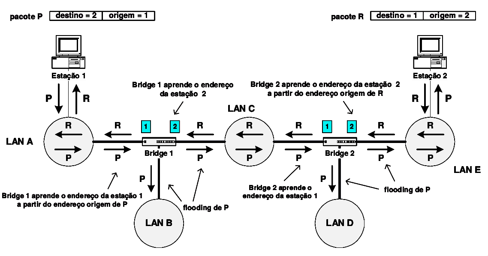

1. A estação 1 quer comunicar com a estação 2
2. Envia um pacote P para a LAN A
3. O pacote P chega à bridge 1
4. A bridge 1 aprende o endereço da estação 1, usando o `source MAC address` do pacote P
4. A bridge 1, que desconhece o endereço da estação 2, efetua um `flooding` do pacote P
5. O pacote P é enviado para a LAN B, de onde não obtém resposta
6. O pacote P é enviado para a LAN C, chegando à bridge 2
8. A bridge 2 aprende o endereço da estação 1, usando o `source MAC address` do pacote P
9. A bridge 2 não conhece o endereço de destino do pacote P
10. A bridge 2 efetua o flooding de P para a LAN D e para a LAN E
11. Na LAN E está ligada a estação de destino, que reconhece o seu endereço MAC
12. A estação 2 responde ao pacote P recebido, enviando o pacote R
13. A bridge 2, como já conhece o endereço de destino, faz o `forwarding` do pacote R da LAN E para a LAN C
	- A LAN D nunca vai receber o pacote R, porque a `bridge 2` sabe qual a porta para onde deve encaminhar os endereços para a estação 1
14. A bridge 1, como já conhece o endereço de destino, faz o `forwarding` do pacote R para para a LAN A
15. A estação 1, ligada à LAN A, recebe o pacote de destino

Quando uma bridge recebe uma trama MAC numa porta de entrada:

- regista na sua tabela de encaminhamento a **porta** em que recebeu a trama e o **endereço MAC** de origem da trama 
- procura o endereço MAC de destino na **trama** da tabela de encaminhamento, para reencaminhar a trama
- se não tiver o endereço de destino efetua `flooding`
- Se tiver o endereço MAC
	- Se for na mesma interface, descarta o pacote
	- Se for noutra interfacem, efetua `forwarding`

- `flooding`: broadcast de um pacote para todas as portas do `switch`, exceto a de origem do pacote, quando este desconhece a porta que deve usar para atingir o endereço de destino. É um processo que é efetuado para o `switch` aprender a que porta se encontra ligada a LAN que contém uma estação com o endereço MAC de destino do pacote. Só acontece quando a tabela de encaminhamento do switch não possui o endereço MAC de destino na sua tabela de encaminhamento. Comporta-se como um repetidor
- `forwarding`: encaminhamento de um pacote de uma porta do `switch` para outra porta do `switch`, usando a porta indicada na tabela de encaminhamento do switch. A bridge envia apenas a trama pela porta registada na tabela.

#### Tabela de Encaminhamento
endereço MAC  interface  tempo de vida
------------ ---------- ---------------
   -              -          -

: Exemplo da organização das tabelas de encaminhamento nos switches

#### TTL - Time to Live of a MAC Address Table ENtries
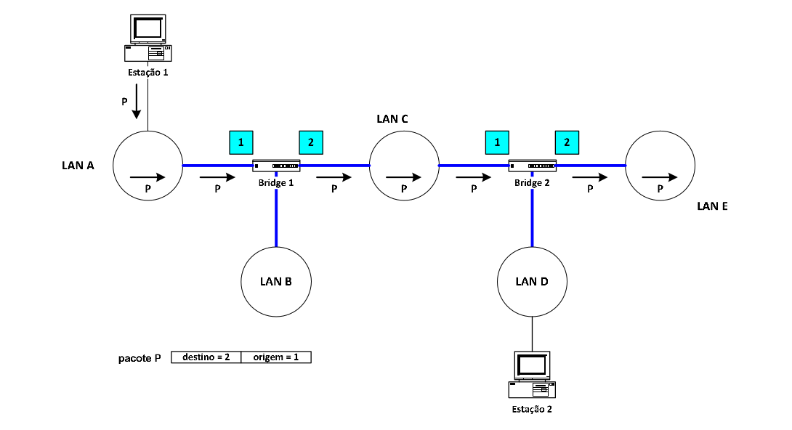

Após a troca da estação 2 da LAN E para a LAN D, a estação 2 deixa de receber pacotes porque as entradas das tabelas de switch das bridges continuam a indicar que devem enviar os pacotes para a LAN E.

As tabelas de encaminhamento só vão ser atualizadas se:

- a estação 2 transmitir
- o tempo de vida (`TTL`) das entradas na tabela de encaminhamento expirar
	- introduz-se mecanismos de aging no sistema
	- é uma forma de evitar bloquear um sistema que tem a noção de estado
	- se a bridge não receber nada da estação durante 30 segundos, remove-a 

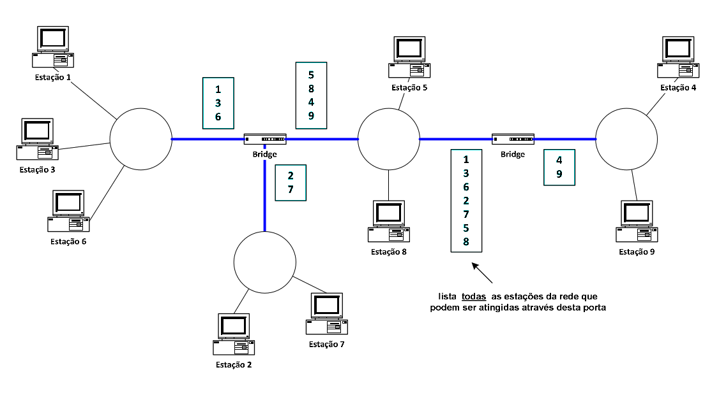

# Interconexão de LANs
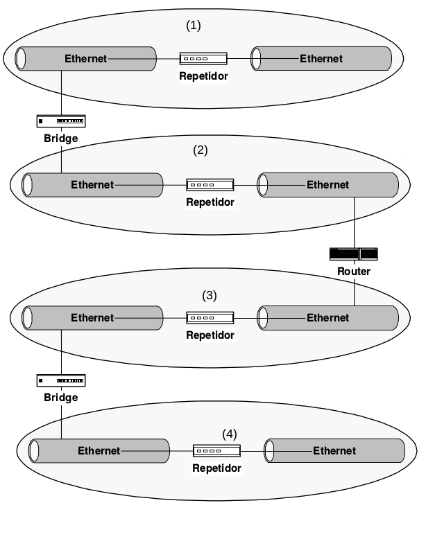

- A LAN 1 e a LAN 2 pertencem ao mesmo domínio de colisão
	- Estão na mesma camada de nível 2
- A LAN 3 e a LAN 4 pertencem ao mesmo domínio de colisão
	- Estão na mesma camada de nível 2
- Os segmentos de Ethernet, dentro de cada LAN, estão ligados por um repetidor, por isso recebem os mesmos pacotes
- O router separa duas redes IP diferentes
	- com diferentes domínios de `broadcast`

Através da figura \ref{routers_vs_switches}, são apresentadas as camadas do protocolo OSI em que operam as bridges e os routers.

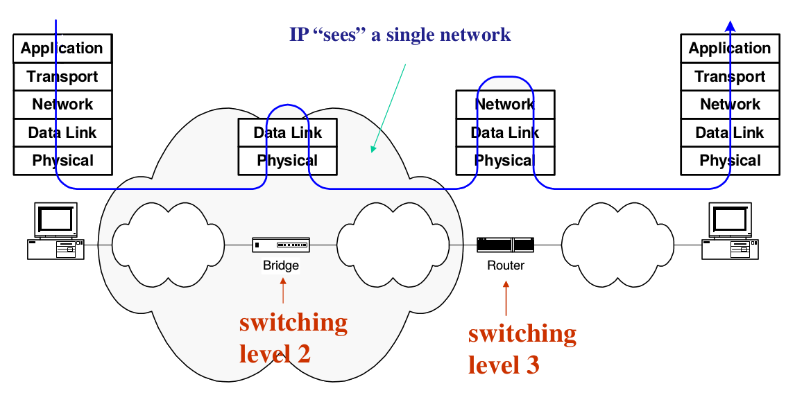

## Routers
- Opera na camada 3
	- Camada IP
	- Nível da rede
- Efetua `level 3` _`"switching"`_
	- O termo correto é `routing`
- tipo `store and forward`
- Comuta com base nos endereços de nível 3
	- IP
	- IPX
	- AppleTalk
	- etc.

## Domínios de colisão e `broadcast`
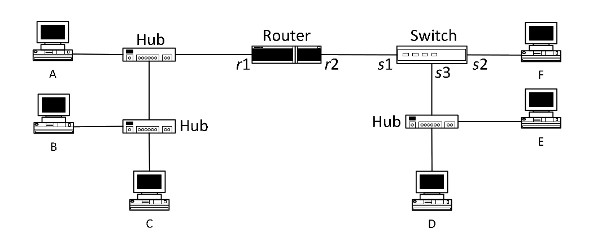

Na figura \ref{collision_and_broadcast_domains} existem 

- Dois domínios de `broadcast`:
	- A, B, C  e $r_1$
	- D, E, F e  $r_2$
- Dois domínios de colisão:
	- interfaces `full-duplex`
		- A, B, C, e $r_1$
		- D, E e $s_3$
	- interfaces `half-duplex`
		- A, B, C, $r_1$, D, E, $s_3$
- Não existem colisões entre as interfaces
	- se forem `full-duplex`
		- ($r_2$, $s_1$) 
		- ($s_2$, F)

Os pacotes só atravessam o switch se:

- forem `unicast` para a `bottom layer`
- forem `broadcast`

### Como é que os switches respondem a colisões?
- `Full-duplex`:
	- As entidades são capazes de comunicar ao mesmo tempo
	- não ocorre conflito
- `half-duplex`:
	- Sou capaz de ou ouvir ou falar
	- Se um dispositivo fala, os outros ouvem
	- Podem ocorrer confiltos
		- Duas estações a tentarem comunicar para o mesmo destino ao mesmo tempo

- Se a linha estiver cheia, os pacotes não são enviados
	- $\implies$ Saturação do link na rede
	- $\implies$ buffer enche
	- $\implies$ Data é perdida

# VLANs - Virtual LANs
- No mesmo `switch` posso declarar a existência de diferentes VLANs
- Duas VLANs diferentes nunca comunicam entre si
	- são totalmente independentes
	- não estão na mesma rede
	- não é possível fazer ping
- é necessário criar ligações físicas entre as VLANs, usando um router
- Se nunca quiser ligar dispositivos entre VLANs diferentes, posso possuir os mesmos endereços locais
-
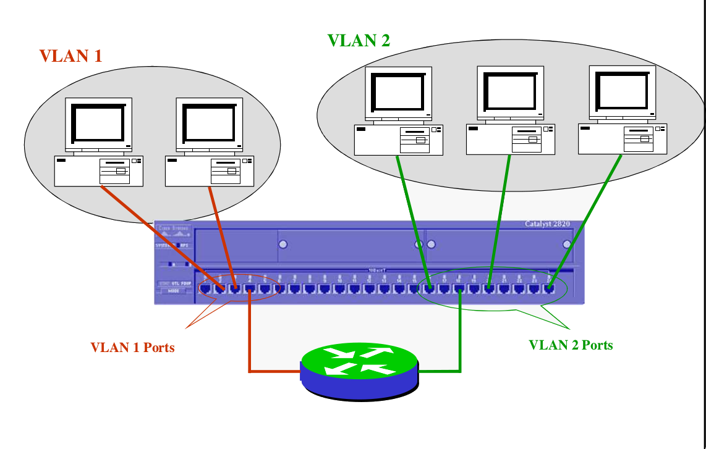

## Ligação entre switches
- ou usa uma porta física, figura \ref{physical_interswitching}
- requer uma porta física especial, `interswitch port`, figura \ref{interswitch_port}
	- protocolo IEEE802.1Q
	- requer o uso de `VLAN tags`
		- permitem identificar diferentes VLANs, através do VLAN ID 
		- permite multiplexar temporalmente a informação no mesmo cabo

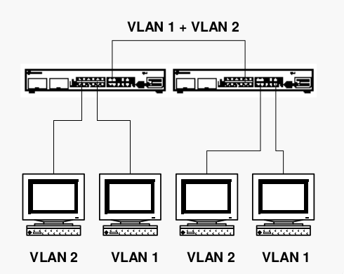

### IEEE802.1Q Standard
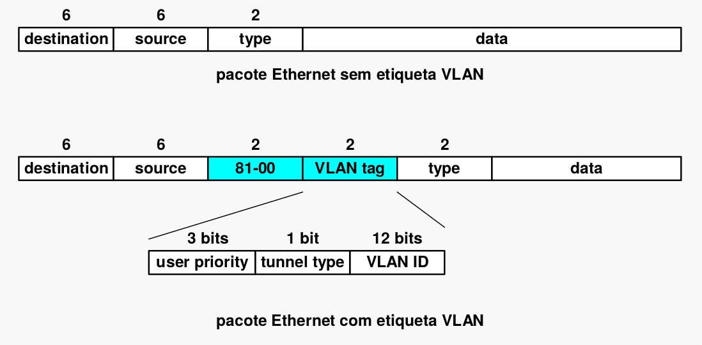

### Redudância
A interligação de bridges/switches com redudância permite dotar a rede de mecanismos de **recuperação de falhas na ede**. 

No entanto, pode trazer problemas ao criar mecanismos de feedback positivo na rede, como por exemplo, o colapso das ligações devido à saturação na rede se ocorrer um broadcast

# Spanning tree
- **Objetivo:** Numa rede que pode ter ligações redundantes entre switches, escolher que portas usar para efetuar as ligações entre várias LANs

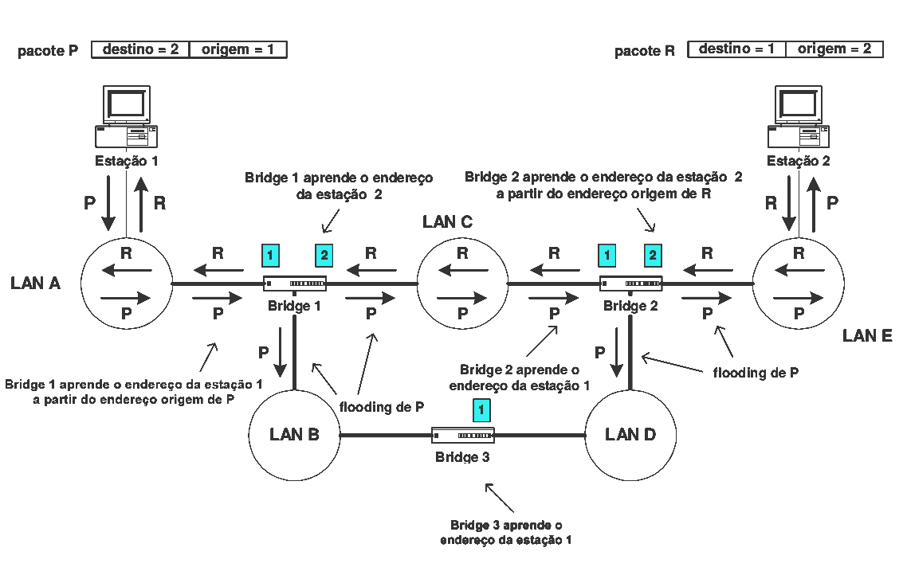

1. A estação 1 quer comunicar com a estação 2
2. Envia um pacote P para a LAN A
3. O pacote P chega à bridge 1
4. A bridge 1 aprende o endereço da estação 1, usando o `source MAC address` do pacote P
4. A bridge 1, que desconhece o endereço da estação 2, efetua um `flooding` do pacote P
5. O pacote P é enviado para a LAN B
6. Na LAN B, o pacote não é enviado pela bridge 3 porque a porta ligada à LAN B está inativa, em resultado do algoritmo da Spanning Tree
6. O pacote P é enviado para a LAN C, chegando à bridge 2
8. A bridge 2 aprende o endereço da estação 1, usando o `source MAC address` do pacote P
9. A bridge 2 não conhece o endereço de destino do pacote P
10. A bridge 2 efetua o flooding de P para a LAN D e para a LAN E
11. Na LAN D, a bridge 3 aprende o endereço da estação 1
11. Na LAN E está ligada a estação de destino, que reconhece o seu endereço MAC
12. A estação 2 responde ao pacote P recebido, enviando o pacote R
13. A bridge 2, como já conhece o endereço de destino, faz o `forwarding` do pacote R da LAN E para a LAN C
	- A LAN D nunca vai receber o pacote R, porque a `bridge 2` sabe qual a porta para onde deve encaminhar os endereços para a estação 1
14. A bridge 1, como já conhece o endereço de destino, faz o `forwarding` do pacote R para para a LAN A
15. A estação 1, ligada à LAN A, recebe o pacote de destino

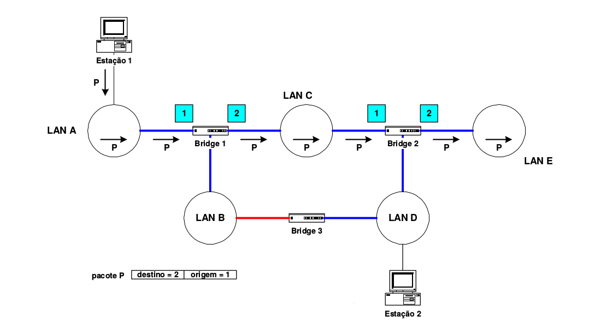

Após a troca da estação 2 da LAN E para a LAN D, a estação 2 deixa de receber pacotes porque as entradas das tabelas de switch das bridges continuam a indicar que devem enviar os pacotes para a LAN E.

O protocolo de spanning tree vai entrar em ação, indicando que a entrada na rede deixou de ser válida para atingir o endereço pretendido, desencadeando os mecanismos necessários para ocorrer as mudanças nas tabelas de encaminhamento.

As tabelas de encaminhamento só vão ser atualizadas se:

- a estação 2 transmitir
- o tempo de vida (`TTL`) das entradas na tabela de encaminhamento expirar por `time-out` do contador do spanning tree
	
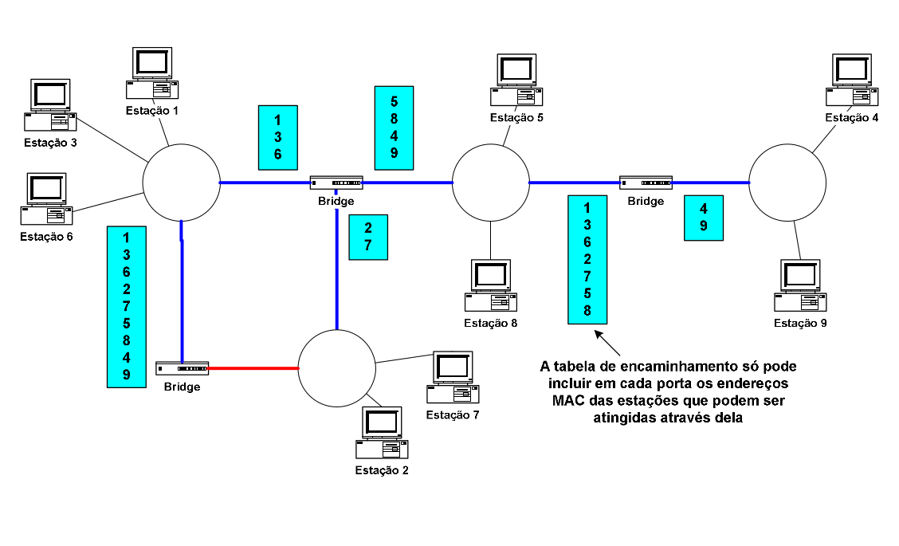

No protocolo Spanning Tree, os nós da rede estão constantemente a aprender o estado da rede. As entradas da tabela de encaminhamento tem uma validade que força a atualização da informação sobre a rede.

A validade das entradas pode ser curta ou longa:

- validade curta
	- 	quando recomeça a transmitir após um intervalo de tempo, irá ser necessário ocorrer `flooding`
- 	validade longa
	- 	quanto se efetua mudanças da máquina entre LANs, esta vai ficar sem coenctividade

Tipicamente, usam-se dois `timings`:
	
- Um para situações de atualização da `spanning-tree`
- Outro para situações de timeout normais da `spanning tree`

Numa situação normal de `time-out`, normalmente as entradas tem um timeout de $\approx$ 5 minutos. Na prática, o valor pode ser diferente, mas é raro obter valores inferiores a 2 min.

Quando a `spanning tree` está em configuração, as spwaning tree sao caluldas de forma diferente em funçãão da raiz da mesma. Não ocorre mudança das máquinas, mas a forma como chega às várias estações é diferente.

A validade de cada uma das entradas é mais curto do que o habitual (normalmente 15 seg). Quando ocorre uma mudança existe um pacote próprio:

-  TCN - Topology Change Notification
	- 	5 min - as tabelas demoram algum tempo a serem limpas
	- 	em termos práticos é difícil ver menos de 2 min 
	
Podemos ter uma spanning tree que é "ineficiente". 
A `spanning tree` procura o camninho mais curto, não o mais estável. 

- por vezes o caminho mais curto não é o mais estável
- não é objetivo do SPT, (Spawning tree protocolo) descobrir o cmninhos mais rápido

## Bellman Equations

Quando os custos das ligações são não-negativos, temos:

\begin{align*}
Comprimento do percurso mínimo de um nó X para A & = Comprimento mínimo de X até ao nó que liga esse nó ao nó A \\
																 & + Comprimento do percurso minimo desse nó para A
\end{align*}																 

O algoritmo de Bellman-Ford caracteriza-se por ser:

- Distribuído
- Assíncrono

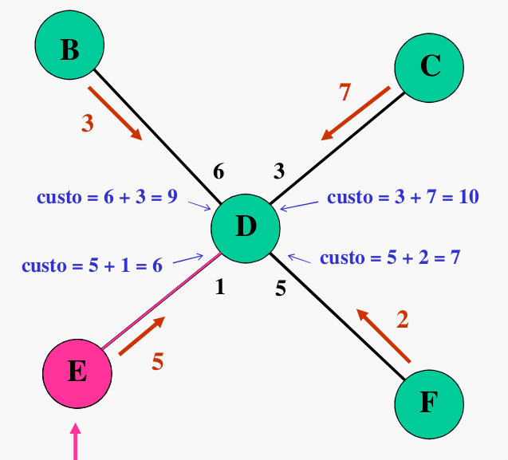

- Cada nó transmite a sua estimativa de custo, $D_j$, para os seus vizinhos, de um intervalo de tempo definido em um intervalo de tempo definido
- Com uma cadência definida, cada nó $ i \neq 1$, a cada iteração, usando as suas últimas estimativas para $D_j$ e a informação mais recente sobre o seu estado e o comprimento das suas ligações de saída, calcula $$D_i = min(d_{ij} + D_j$$

## Forwarding baseado em Spanning Trees
- É escolhida uma brdige como nó de origem
- As outras bridges usam o algoritmo de Bellman-Ford assíncrono e distribuído
	- Calculam para decidir qual o nó vizinho que devem usar 
	- O percurso escolhido deve ter o custo míbimo para o nó origem
- As ligações compostas pelos percursos de **custo mínimo** (de todas as bridges para a origem), definem uma spanning tree [^1]
- Só as portas ativas é que compõem as ligações da `spanning tree`
- É necessário um critério para desempatar quando há múltiplos percursos de curso mínimo

\begin{center}
	\begin{figure}
		\subfloat[Gráfico da rede]{\includegraphics[width= 0.25\textwidth]{pictures/spanning_tree_example.png}}
		\hfill
		
		\subfloat[1º exemplo de uma spanning tree possível]{\includegraphics[width= 0.25\textwidth]{pictures/spanning_tree_example_1.png}}
		\hfill
		
		\subfloat[2º exemplo de uma spanning tree possível]{\includegraphics[width= 0.25\textwidth]{pictures/spanning_tree_example_2.png}}\\
		\hfill
		
		\subfloat[3º exemplo de uma spanning tree possível]{\includegraphics[width= 0.25\textwidth]{pictures/spanning_tree_example_3.png}}
		\hfill
		
		\subfloat[4º exemplo de uma spanning tree possível]{\includegraphics[width= 0.25\textwidth]{pictures/spanning_tree_example_4.png}}
		\hfill
		
		\subfloat[5º exemplo de uma spanning tree possível]{\includegraphics[width= 0.25\textwidth]{pictures/spanning_tree_example_5.png}}\\

		\caption{Exemplo de uma rede e múltiplas spanning trees possíveis} \label{fig:1}
	\end{figure}
\end{center}

[^1]: árvore abrangente

## Funcionamento da Spanning Tree
[Exemplo do funcionamento da Spanning Tree](pictures/spanning_tree_basics.png)

- `Bridge ID`: cada bridge é identificada por um endereço que contém:
	- 2 octetos de prioridade
	- configuráveis pelo gestor de rede
		- 6 octetos fixos
	- Um dos endereços MAC das portas da bridge
		- QUalquer outro endereço único de 48 bits
	- A prioridade possui precedência sobre o campo de octetos fixos
- `Bridge raiz` _(root bridge)_: 
	- bridge que está na raiz da spanning tree
	- bridge com menor bridge ID
- `Path cost`:
	- custo associado a cada porta da bridge
	- pode ser configuado pelo gestor de rede
- `Designated Birdge` _(bridge designada)_:
	- bridge que numa LAN é responsaǘel pelo envio de pacotes da LAN para a bridge raiz e vice-versa
	- a bridge raiz é a bridge designada em todas as LANs a que está ligada
	- ver figura \ref{designated}
- `Designated Port` _(porta designada)_:
	- porta que numa LAN é responsável pelo envio de pacotes da LAN para a bridge raiz e vice-versa
	- uma das portas da bridge designada
	- ver figura \ref{designated}
	- **em cada LAN**, a porta que fornece o **melhor percurso** (menor custo) para a raiz
- `root port` _(porta raiz)_ 
	- porta que numa bridge é responsável pela receção/transmissão de pacotes de/para a brdige raiz
	- figura \ref{root_port}
	- em **cada brdige**, a porta que fornece o **melhor percurso** (menor custo) para a raiz

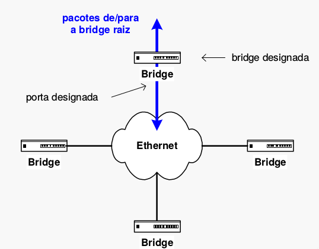

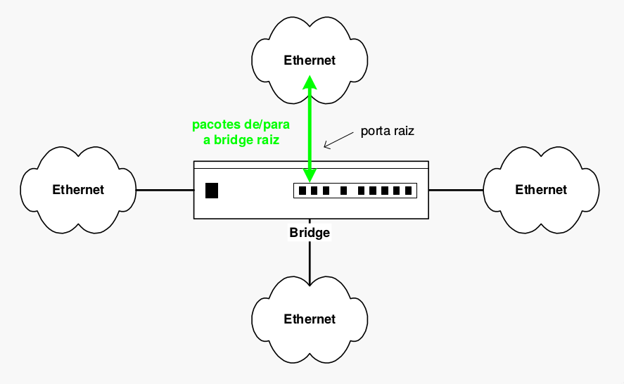

Cada bridge tem associado a si um **custo do percurso para a raiz (`Root Path Cost`)** igual à soma dos custos das portas que recebem pacotes enviados pela raiz (portas raiz) no percurso de menor custo para a bridge. Ver figura \ref{root_path_cost}.

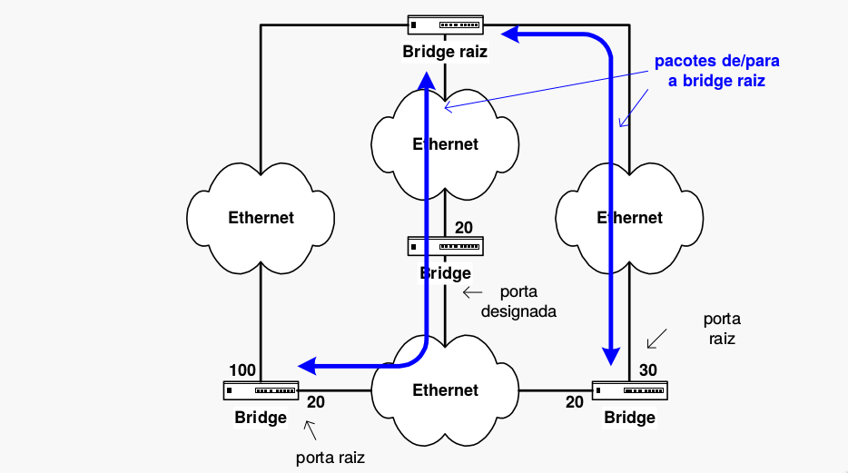

As **portas ativas** em cada bridge são a **porta raiz** e as **portas designadas**. As restantes portas estão **inativas** _(blocking)_

### Exemplo de Mudança
1. Uma porta passa ao estado blocking
2. A bridge que perdeu conectividade envia um TCN 
3. A partir desse momento, a bridge acima recebeu o TCN 
4. Envia um TCA - Topology CHange Ack para a outra bridge, a informar que já sabe que a ligação não existe
5. Envia um TCN na sua root port para outra bridge
6. O processo repete-se até chegar à raiz da rede
7. A raiz envia um BPDU com um TC - Toplogy Change
8. Os bridges mudam o timeout de reconfiguração
9. A reconfiguração aocntece
10. As spanning trees são atualizadas

## Protocolo IEEE 802.1D
- Para construir e manter a spanning tree as brdiges trocam mensagens entre si
- Estas mensagens são desingadas de BPDUs - Bridge Protocol Data Units
- Existem dois tipos:
	1. Configuration 
	2. Topology Change Notification

O Header do pacote é apresentado na figura \ref{ieee_802_1d_header}

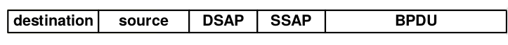

- `Destination`: endereço multicast atribuído a todas as bridges
- `Source`: endereço MAC da porta que enviou o BPDU
- `DSPAP` = `SSAP` = $0100010$ = $0x42$

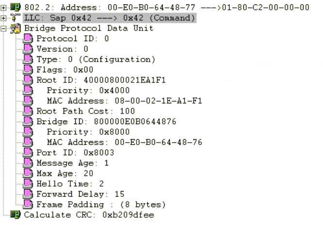

Os campos mais importantes são:

- `Root ID`: estimativa atual do endereço da bridge raiz
- `Root Path Cost`: estimativa atual do custo para a bridge raiz
- `Bridge ID`: endereço da bridge que envia a mensagem de configuração
- `Port ID`: endereço da porta que envia a mensagem de configuração

## Manutençao da Spanning Tree
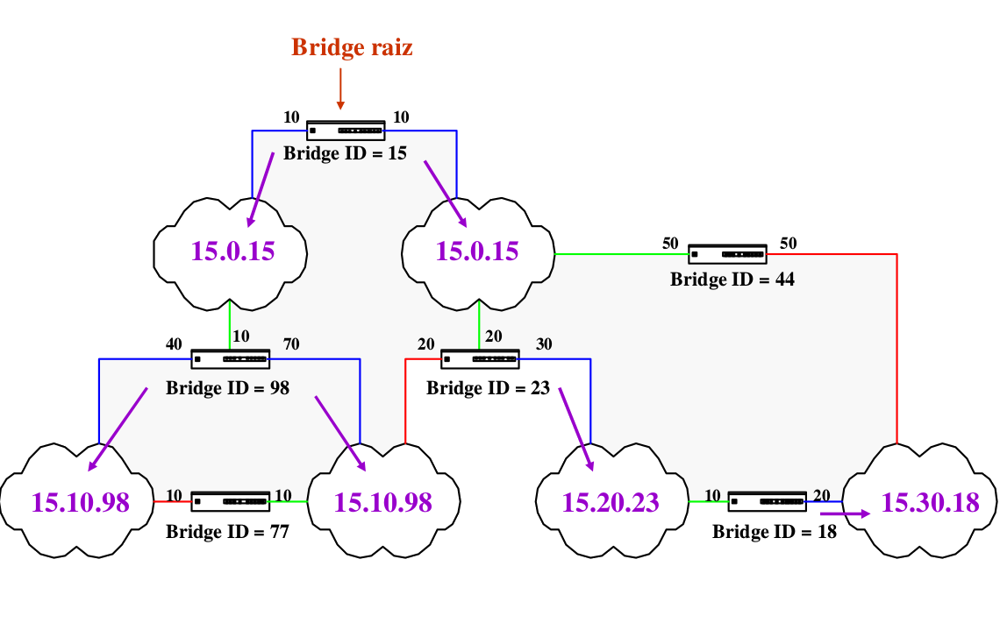

- Convenção para Configuration-BPDUs:
	- `root bridge`
	- `root path cost`
	- `bridge ID`
- Periodicidade das Configuration-BPDUs = _hello time_
	- _hello time_ recomendado: 2 seg

### Order of configuration messages
Uma mensagem de configuração $C_1$ dize-se melhor que outra, $C_2$, se:

1. o `root ID` de $C_1$ for inferior ao de $C_2$
2. Se os dois `root IDs` forem iguais, o `root path cost` de $C_1$ for inferior ao de $C_2$
3. Se os `root IDs` e `Root Path Cost` forem idênticos, o `bridge ID` de $C_1$ for inferior ao de $C_2$
4. Sendo idênticos os `root IDs`, `root path cost` e `bridge ID`, o `Port ID` de $C_1$ for inferior ao de $C_2$

Root ID     Root Path Cost   Bridge ID   Port ID
--------  ----------------- ----------- ----------
18           27               32           2
18           27               32           4
18           27               43           1
18           35               23           3
18           31               45           2

:Table que mostra a ordenação, do melhor para o pior, das mensagens de configuração

## Construção da Spanning Tree

1. Cada bridge assum inicialmente que é a bridge raiz
	- `root path cost` = 0
	- Envia mensagens de configuração em todas as suas portas
	- figura \ref{spanning_tree_step_1}
2. As melhores mensagens recebidas pela bridge que enviou as mensagens de configuração permitem decidir qual a `root port`
	- Usam a estiamtiva do `root path cost` enviada por cada uma das bridges
	- o `root path cost` é igual à soma do custo da:
		- porta raiz da bridge 
		- `rooth path cost` da melhor mensagem de configuração recebida até ao instante
	- Através da figura \ref{spanning_tree_step_1}, podemos concluir que
		- O `root ID` mais baixo é 41, mas existem 4 bridges com este ID
		- O `root path cost` mais baixo é o 12, mas existem 2 bdiges com este `root path cost`
		- O `bridge ID` mais baixo é 111
		- Assim, na figura:
			- **bridge raiz** = 41
			- **porta raiz** = 4
			- **custo para a raiz** = 12 + 1 = 13, supondo que os custos das portas são todos unitários

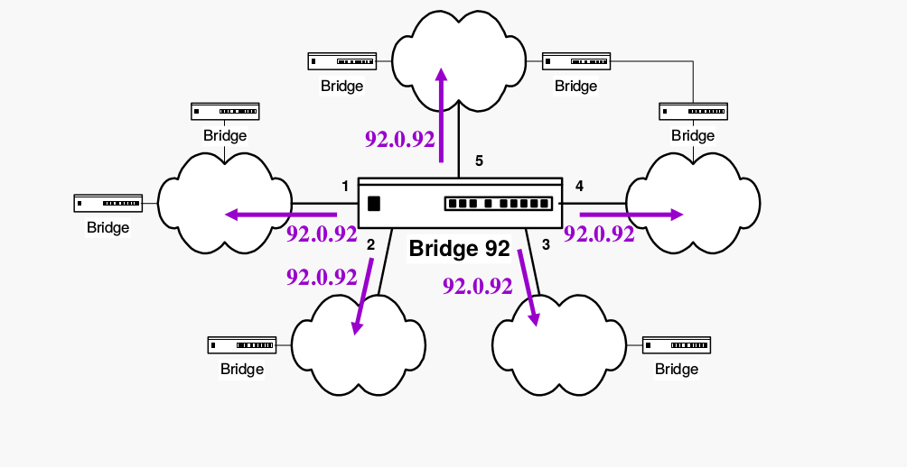

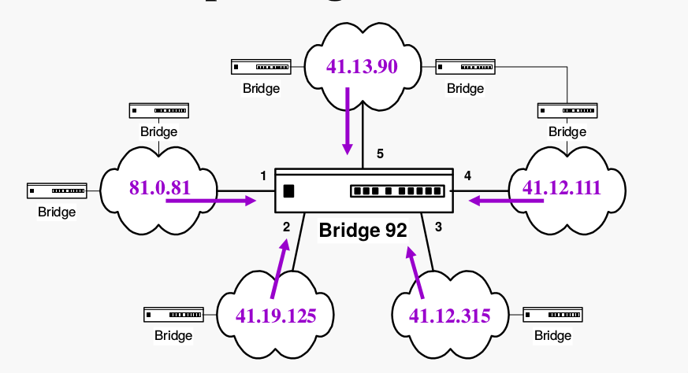

- Quando um bridge recebe, na que julga ser a sua **porta raiz**, uma mensagem de configuração **melhor** que a mensagem de configuração que iria transmitir, com base nas suas estimativas atuais de `root ID` e `root path cost`, transmite essa mensagem de configuração em todas as portas em que **bridge designada**
- Quando uma bridge recebe **numa porta** uma mensagem de configuração **melhor** do que aquela que iria transmitir (com base nas suas estimativas actuais de **Root ID** e **Root Path Cost**), a bridge **cessa de transmitir mensagens de configuração nessa porta**
	- a porta passa ao estado `blocking`
- Quando uma bridge recebe numa porta uma mensagem de configuração **pior** do que aquela que iria transmitir (com base nas suas estimativas actuais de `Root ID` e `Root Path Cost`), a bridge **transmite a sua mensagem de configuração nessa porta**
	- este acontecimento pode ser visto na figura \ref{spanning_tree_step_3}

### Exemplo
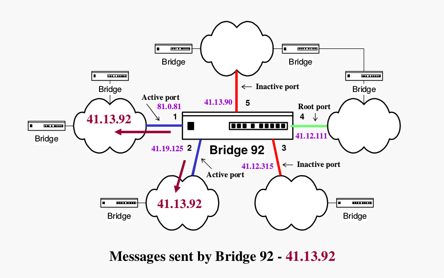

1. A bridge 83 envia 83.0.83 em Eth1, Eth2 e Eth3
2. A bridge 21 envia 21.0.21 em Eth2 e Eth3 (83 fica a saber que não é raíz)
3. A bridge 83 envia 21.20.83 em Eth1 (porta raiz = 2)
4. A bridge 18 envia 18.0.18 em Eth1 e Eth3 (21 fica a saber que não é raíz)
5. A bridge 21 envia 18.20.21 em Eth2
6. Mas a bridge 83 tem uma mensagem melhor para a Eth2
7. A bridge 83 envia 18.10.83 em Eth2 (porta raiz = 1, Path Cost = 10)

O Algoritmo convergiu. No entanto, continuam a ocorrer um conjunto de operações periódicas.

- A bridge raiz envia periodicamente 18.0.18
- A bridge 83 retransmite com 18.10.83 em Eth2
- A bridge 83 é a bridge designada em Eth2 e a sua porta raiz é a 1.
- A porta 3 está inactiva.
- A porta 1 da bridge 21 está inactiva.
- A bridge 18, sendo a raiz, é a bridge designada em Eth1 e Eth3.

## Breakdown em bridges ou LANs

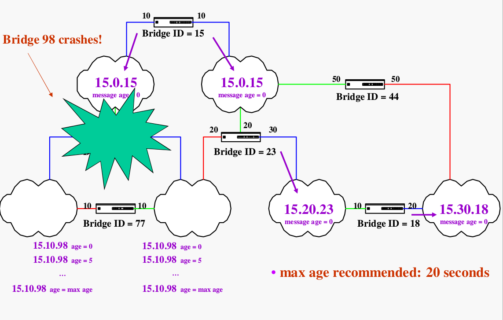

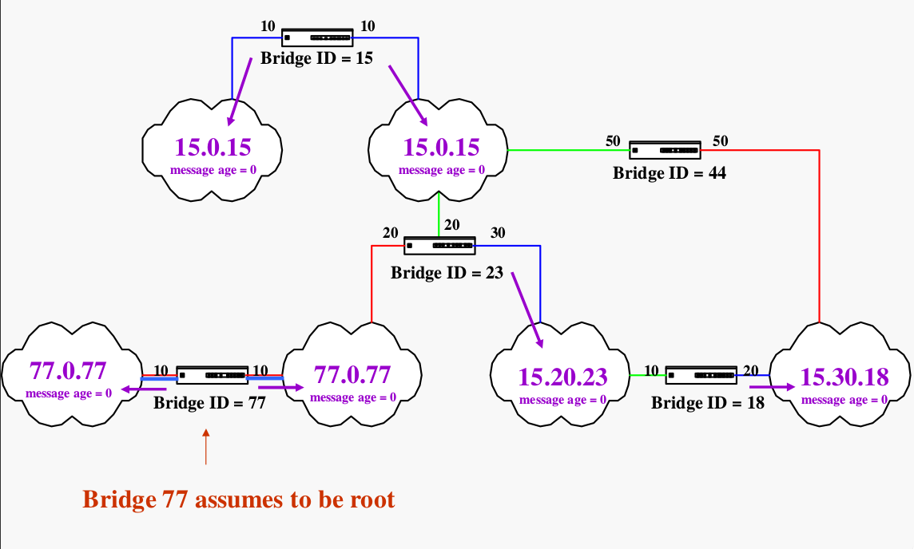

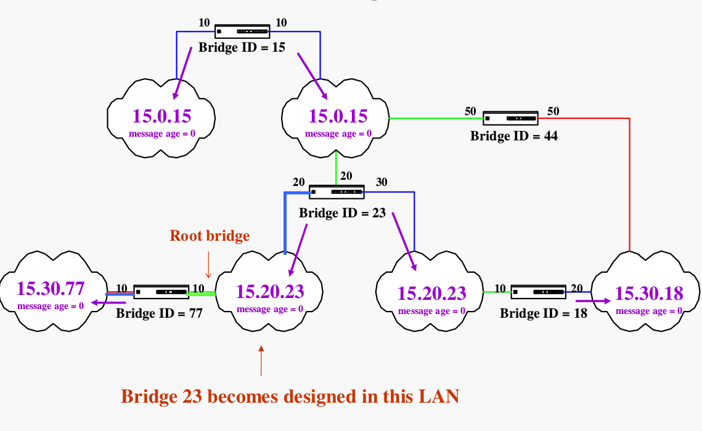

### Ciclos temporários
Após a alteração da topologia da rede, pode ocorrer:

- **perda temporária de conectividade:**
	- uma porta estava inativa na topologia antiga deve estar ativa na nova topologia
- **ciclos temporários:**
	- uma porta que estava ativa na topologia antiga deve estar inativa na nova topologia

De modo a evitar os ciclos tem+poraŕios que se podem estabelecer momentaneamente e fazer com que a rede crashe, quando ocorre a troca de otopologias, é necessário que as +portas esperem algum tempo antes de permitirem que uma das suas portas passe do estado inaivo p+ara ativo. Este tempo de espera denomina-se `forward delay`.

## Bridge Port States

- **estado `blocking`**
	- os processos de aprendizagem e de expedição de pacotes estão **inibidos**
	- recebe e processa **mensagens de configuração**
- **estado `listening`**
	- o processo de aprendizagem e expedição de pacotes estão **inibidos**
	- transita para o estado `learning` após um tempo de permanência neste estado ligado a `forward delay`
	- recebe e processa mensagens de configuração
- **estado `learning`**
	- o processo de aprendizagem está **activo**
	- o processo da expedição de pacotes está **inibido**
	- transita para o estado forwarding após um tempo de permanência neste estado igual a `forward delay`
	- recebe e processa mensagens de configuração
- **estado `forwarding`**
	- **estado ativo**
		- processo de aprendizagem ativo 
		- processo de expedição de pacotes ativo
	- recebe e processa mensagens de configuração
- **estado `disabled`**
	- **estado inativo**
		- processo de aprendizagem inativo 
		- processo de expedição de pacotes inativo
	- Não participa no algoritmo da spanning tree

### TTL of entries of the forwarding tables
- Tradeoff:
	- **Tempo de vida demasiado longo:** pode haver um número exagerado de pacotes perdidos quando a estação muda de localização
	- **Tempo de vida demasiado curto:** o tráfego na rede pode ser exagerado devido ao processo de `flooding`

Existem dois tempos de vida usado:

- `Longo`: 
	- usado por defeito
	- valor recomendado: 5 minutos
- `Curto`:
	- usado quando a spanning tree está em reconfiguração
	- valor recomendado: 15 segundos
	- exige processo de notificação de alterações da topologia da rede

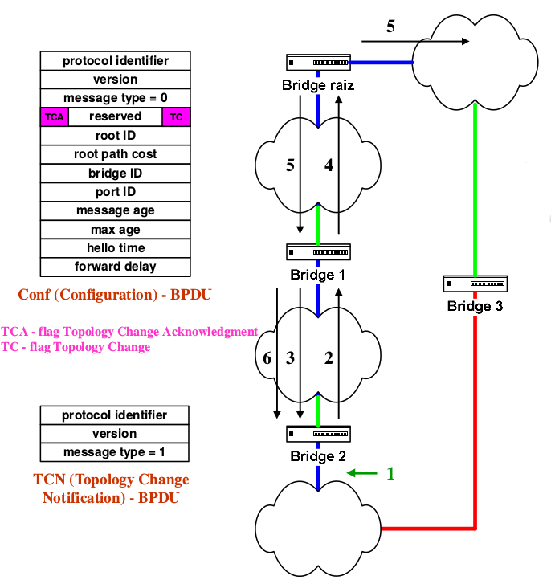

- (1) Porta passa ao estado blocking
- (2) A bridge 2 envia um TCN-BPDU, com a periodicidade de _hello time_
- (3) A bridge 2 envia um Conf-BPDU com TCA = 1 até deixar de receber o TCN-BPDU da bridge 2
- (4) A bridge 1 envia um TCN-BPDU, com periodicidade _hello time_. 
- (5) A bridge raiz envia um Conf-BPDU com TC=1 (Toplogy Configuration), duarante um tempo `forward delay` + `max age`
	- inicia o processo de reconfiguração. 
	- a bridge 1 e 3 passam a usar o tempo de vida curto nas suas table as de encaminhamento durante esse período
- (6) A bridge 1 repete o Conf-BPDU com TC=1
	- a bridge 2 passa a usar o tempo de vida curto nas suas tabelas até voltar a ouvir TC = 0

#### Exemplo de uma spanning tree ineficiente
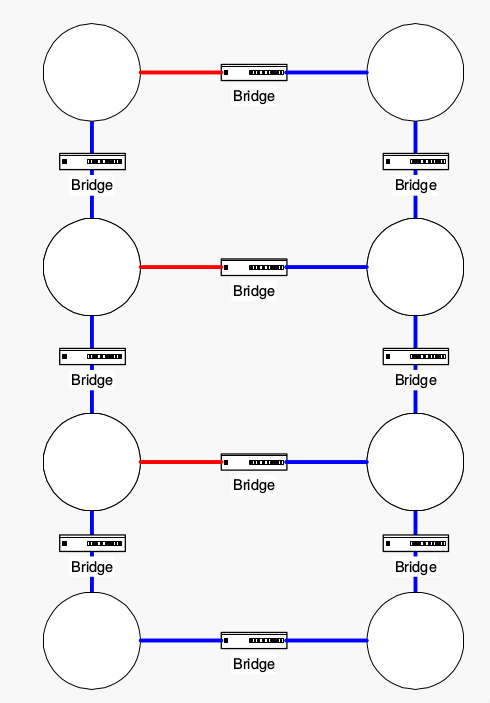

## Protocolos

### 802.1p
- extensão do IEEE 802.1Q
- permite mapear nos bit da ethernet prioridades
	- pode ser usado para qualidade de serviço
	- Campo `User Priority` (3 bits)
		- 8 níveis de prioridade

Prioridade  Descrição
---------- ------------
7            tráfego crítico de gestão de rede
5-6          tráfego sensível ao atraso (e.g., voz e vídeo)
1-4          tráfego sensível à variação do atraso (streaming)
0				 restante tráfego (e.g., transferência de ficheiros)

: Recomendações do uso de prioridades da norma

### 802.1w Rapid Spanning Tree Protocol
- extensão do IEEE 802.1D
- Acelera o ponto de convergẽncia relativamente ao 802.1D
	- mais rápido a convergir
- Altera os estados e funções de cada porta
- Introduz um mecanismos de negociação entre bridges
- usa os bits entre as flags TCA e TC
	- bits entre o `topology change` e o `topology change adverstiment` que permite às bridges convergir mais rapidamente
- Mais informação: [Understanding Rapid Spanning Tree Protocol (802.1w)](http://www.cisco.com/warp/public/473/146.html)

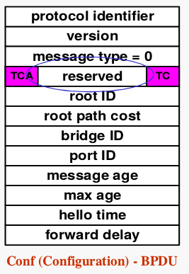

### 802.1s - Multiple Spanning Tree Protocol
- O STP e RSTP não reconhecem VLANS
	- Primeiro é necessário estabelecer as spwanign tree
	- Ao criar as VLANs fecho portas nas spanning trees
	- Se existir tráfego nas VLANs não devia haver problema
	- Se as bridges não tiverem tráfego na altura de criação das VLANs, vamos ter problemas
	- Uma vez que as VLANs estão separadas, não vai ser possível criar uma spanning tree unica
- este protocolo trata de criar as spwaning trees asssociadoas as vlans
- Permite criar múltiplas Spanning Trees e atribuir cada VLAN a uma das Spanning Trees criadas
- Usa os protocolos IEEE 802.1W (VLANs) e IEEE 802.1w (RSTP)
- Permite criar **múltiplas regiões**
	- Fora das regiões funciona como o protocolo IEEE 802.1D
- Mais informação: [Understanding Multiple Spanning Tree Protocol (802.1s)](http://www.cisco.com/warp/public/473/147.html)

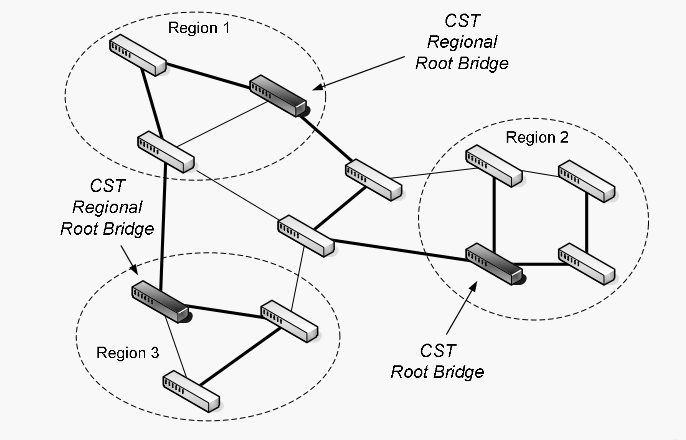

