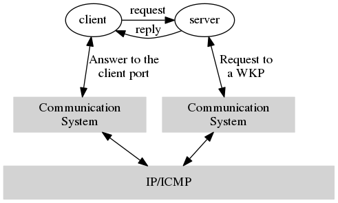
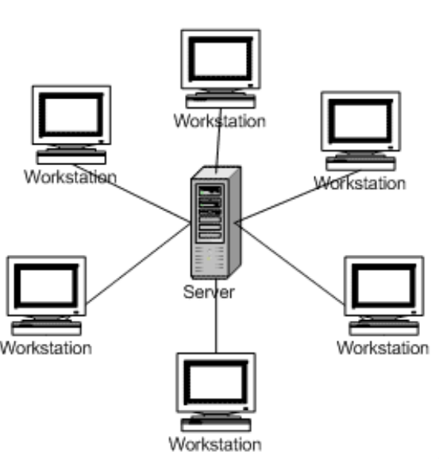
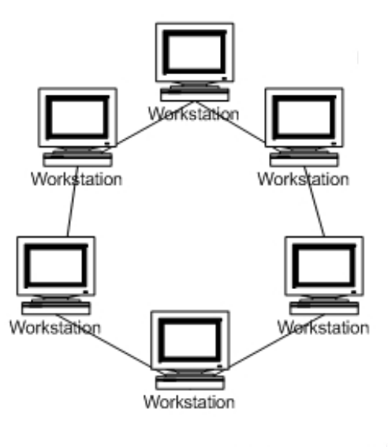
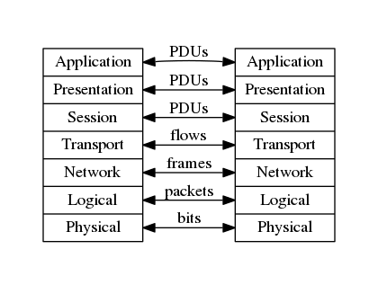
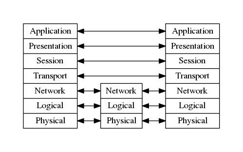
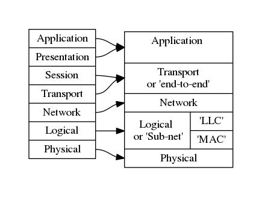
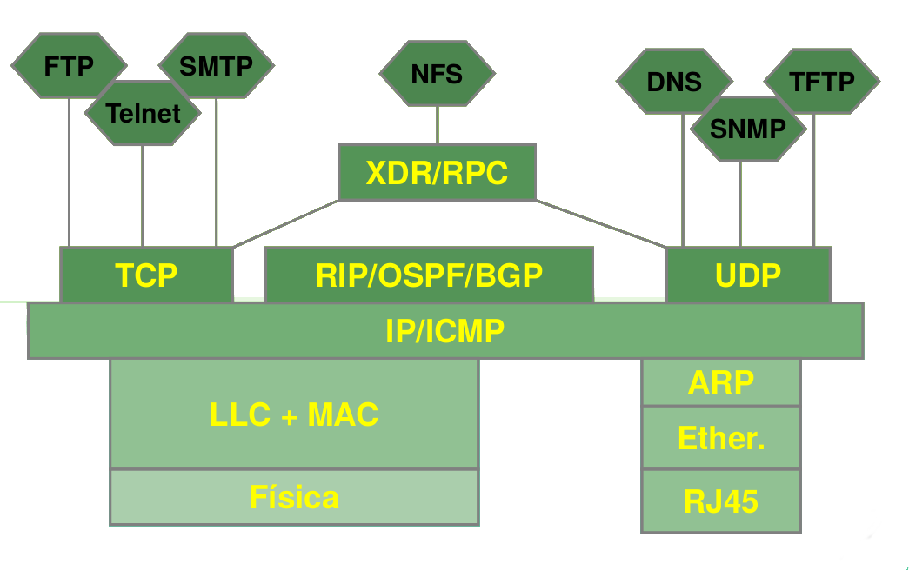

# IP Networks

## Breve História da Internet
- Começou por ser uma experiência no meio académico no final da década de 60
- Inicialmente ARPANET, depois NSFnet e agora, "ANYBODYSNET"
	- Não é proprietária
- Não é detida por uma única entidade
	- Existem vários serviços a providenciar:
		- acesso
		- alojamento
	- Diferentes entidades a criar e partilhar conteúdo
- O organismo máximo que regula a Internet é a _Internet Society_

A origem da Internet remota ao período da Guerra Fria nos Estados Unidos, 
quando o mecanismo primário de comunicação era a rede telefónica.
O principal problema desta rede é que os `switchs` são ligados de forma estruturada.
Isto implica que se um dos `switches` for destruído ou sabotado [^1], o sistema de
comunicação do país ficava **inoperacional**


A solução encontrada foi utilizar um sistema distribuído.

- Ocorre a remoção do **`single point of failure`**
- A rede torna-se mais robusta e fiável
	- Passam a existir múltiplos links de ligação entre os dispositivos
	- o `routing` passa a ser distribuído.


Se um nó da rede for removido abruptamente, a rede possui a capacidade de 
continuar a transmitir informação:

- Atualmente, com `switching` ótico, a rede precisa de apenas 200 $\mu $ para recuperar
e restabelecer a comunicação
- Antigamente, se um router fosse eliminado, eram precisos entre 5 a 10 min para restabelecer
a comunicação

A UUNET já não existe

[^1]: O clima era de uma possível guerra

Problem: Resiliency of our infrastructure

### The Internet Society
`RFC` - Request For Comments


A Internet funciona com base em **consensos** (protocolos) e **código funcional** (implementação dos protocolos) .

Os protocolos só são validados se diferentes equipas conseguirem implementar o protocolo e testar a sua funcionalidade 
independentemente e uns com os outros. Não basta uma equipa desenvolver um protocolo, implementá-lo e testá-lo.
É preciso os resultados puderem ser verificados por outros grupos de investigadores.

É dividida em 9 diferentes áreas/_development topics_.
Dentro de cada área existem diferentes _working groups_

IESG:

- Usa os resultados dos outros grupos


IAB
IANA (Internet Assigned Number Authority)

- Como são geridos os DNS
- Como são geridos os domínios


TLD: top level domains

As conexões entre a Internet Tree não é hierárquica


### Evolução da Internet
- Pode ser divida em 3 grandes fases
- **Startup:** Académica & Investigação (DARPA)
- **Scaling:** Redes Empresariais
	- Rede aberta, disponível para todos
	- Foi criada a NSF(National Science Foundation) para gerir a rede
- **Universal:** A rede passou a ser pública, acessível por todos

 
#### 1990: Internet Crisis
 
- A tecnologia foi toda paga pelo Governo Americano
- Questões que se colocam:
	- Quem é o dono da Internet?
	- Quem é o responsável pela sua gestão?
- Solução: 
	- Criação de um órgão de gestão: `The Internet Socienty`
- Todos o material público na Internet pertencem à `Internet Society`

 
## O que é a Internet?
Con junto de dispositivos ligados entre si, que podem ser:

	- `hosts`
	- `terminal systems`
São exemplo de dispositivos computadores, telemóveis, sensores, _smart TVs_, etc. 
Cada dispositivos executa uma **aplicações distribuídas**, ou seja:

- O dispositivo que executa a aplicação é diferente
- Vários dispositivos na rede a correrem a mesma aplicação
- A rede que interliga todos os dispositivos é a mesma

 Estes dispositivos estão ligados através de `links`. Estes links normalmente são de fibra ótica.


A Internet é uma **"rede de redes"**, permitindo a ligação entre diferentes redes, que podem conter características muito diferentes. É aproximadamente hierárquica

Pode definição, uma rede privada de Internet não faz parte da Internet. A esta rede chamou Intranet.

Para ter uma rede privada de Internet apenas preciso de correr o protocolo TCP-IP

É uma rede com bastantes protocolos:

- TCP-IP
- IP
- HTTP
- FTP
- PPP

Os standards da Internet Society definem dois documentos:

- RFC: Request for comments
	- onde são sugeridos e aprovados novos protocolos
- IETF: Internet Engineering Task Force
 
Ninguém sabe ao certo qual é o tamanho da internet. O número de routers que se tem de passar para chegar de um ponto ao outro da Internet é **muito variável**.

É possível chegar à China em 30 routers. Estima-se que o maior trajeto entre dois pontos seja um número entre 130 e 140 routers

## Glossário:
- **Routers:** dispositivos que transportam pacotes entre conexões físicas a redes diferente
- **network:** sistema usado para conectar computadores que usa apenas uma tecnologia única de transmissão

## Comunicação
Internet é um sistema escalável e capaz de se dividida em sub-redes, que utilizam os mesmo protocolos.
A comunicação é feita entre diferentes dispositivos:

- `servers`: 
	- dispositivos que armazenam a maior percentagem de informação da rede. 
	- atuam como dispositivos de armazenamento de informação
	- podem ser vistos como "produtores", numa lógica produtor consumidor
- `hosts`: 
	- dispositivos que pedem informação aos servidores
	- podem ser vistos como "clientes" da informação armazenada nos servidores, seguindo uma lógica produtor consumidor.


Internet como uma entidade requer:

- elementos de comutação
- elementos terminais


As conexões físicas são asseguradas através de cabos e `routers`.


```bash
# Para visualizar a IP routing table
$ route
```

# Typical Service Mix
- A largura de banda dedicada para streaming de videos está a aumentar.
- As redes sociais têm causado um aumento no upload de vídeos

## Internet
Melhore do que a rede telefónica, a internet permite ganhos de multiplexagem:

É um recurso flexível:

- Na maioria dos tempos, quando preciso de um gigabit, tenho um gigabit
- Mas como na maioria dos tempos não preciso, a rede é sub dimensionada
	- Os utilizadores recebem menos que um gigabit, apesar de lhes ser dito que a rede fornece um gigabit


**Congestão da rede:** Todos os os utilizadores precisam de 1 Gigabit


- A Internet nunca garante serviços de emergência, ao contrário de uma rede telefónica
- É uma rede **best effort:** a rede faz o melhor que pode, com os recursos que têm. Se o melhor que puder fazer não chega, a qualidade do serviço é diminuída

A camada física é muito melhor do que era anteriormente.

## Protocolos
Os protocolos criam uma conexão lógica sobre a conexão física que interliga dois ou mais dispositivos.

Definem os:

- _standards_
- procedimentos
- interpretação da informação a ser transmitida


Um protocolo é um procedimento formal entre duas entidades que:

- especifica que mensagens são enviadas
- define o formato e a ordem das mensagens a serem enviadas e recebidas entre as entidades da rede
- especifica que ações são executadas quando as mensagens são recebidas

Diferentes pedidos têm obviamente diferentes formatos e diferentes ações que devem ser tomadas

## Pacotes
- A informação é partida em pacotes
- Os pacotes são transferidos, numa filosofia _best effort_
	- se forem perdidos ou chegarem fora de ordem não interessa
- Existem protocolos que possuem a responsabilidade de:
	- detetar pacotes em falta
	- detetar e ordenar pacotes fora de ordem.


Os protocolos funcionam nos extremos da rede e não no seu intermédio/caminhos da rede.

Os seres humanos utilizam um protocolo a comunicar com os outros

- gestos
- frases
- postura

Em qualquer tipo de comunicação (humano-humano, humano-máquina, máquina-máquina),
tem de ser acordado um protocolo de comunicação:

- Tensão
- Número de cabos a utilizar
- Como se caracteriza o nível lógico '0'?
- Como se caracteriza o nível lógico '1'?
- Como é efetuada a transmissão?
	- bit?
	- byte?

Um protocolo é um **acordo entre duas entidades**


## Internet Structure Internet Service Provider
- A Internet está organizada em `Tiers`.
- Cada `tier` representa uma área de prestação de serviços


A estrutura da Internet (i.e., os `tiers`) estão organizados de forma aproximadamente hierárquica.

Normalmente, cada `tier`representa um **ISP:** Internet Service Provider. 
Por isso se diz que a Internet é basicamente hierárquica

Os **ISPs** podem ser classificados em:

1. ISPs de nível 1: Cobertura Nacional ou Internacional, e.g, Sprint e AT&T
2. ISPs de nível 2: Cobertura Regional
3. ISPs de nível 3/IPs locais: `Access Networks`

Devido a esta forma de ligar as redes, um pacote **atravessa várias redes entre dois endpoints**

A esta forma de `routing` chamamos `valley-free routing`, porque se organizarmos hierarquicamente a estrutura de routing:

1. Primeiro o pacote sobe a hierarquia até atingir os ISPs de nível 1
2. Depois transita para o ISPs de nível 1 de destino
3. De seguida desce na hierarquia, até chegar novamente ao endpoint

O tráfego segue estas rotas **apenas de forma aproximada**. Isto não é verdade em 90% dos casos


`WireShark`: Permite enviar pacotes para e rede e estudar o comportamento da mesma

# Classification Styles

Numa rede de comunicações precisamos de saber:
- Quantas pessoas/dispositivos estão conectados num mesmo instante de tempo
- Se os dispositivos estão a falar diretamente entre eles ou com uma entidade hierarquicamente acima deles na rede
- missing one!
- Como é que a informação é enviada. O quer torna:
	 - um email num email
	 - uma mensagem numa mensagem
	 - um ficheiro num ficheiro
	 - etc.
- Que tipo de formalidades estamos a usar na comunicação


As comunicações entre as diferentes entidades da rede podem ser classificadas dependendo de:

- tipologia do mecanismo de `routing`/`forwarding` utilizado para ou o formato da transmissão
- A relação que as entidades possuem na camada de transporte
- A relação/importância hierárquica que possuem
- As relações que cada uma das entidades estabelece com outras entidades
- Número de entidades envolvidas

# Methods for information forwarding in networks

## Circuit Switching
- São reservados recursos entre os _endpoints_ para a conexão durante todo o tempo em que a mesma dure
- Podem ser necessários processos auxiliares para inciar e finalizar a conexão
	- Estes processos são **externos** ao sistema de conexão, tendo de existir antes de uma chamada ser efetuada e depois de a chamada terminar
- Todo o processo de conexão é feito offline

Antigamente todos os métodos de routing eram por _circuit switching_: correspondiam a alguém conectar fisicamente dois cabos, que efetuada uma ligação entre o destinatário da chamada e quem a iniciou. Mais tarde passou a ser um processo eletromecânico.

Cada pessoa tinha um cabo reservado para si e após a conexão ser estabelecida, a linha que será usada para a chamada é uma diferente da que foi usada para a iniciar


Impõe delays e _jitter_[^2], que para além de conhecidos e fixos, são normalmente baixos.

A implementação física da rede tem de conseguir garantir que podem ser reservados uma quantidade de recursos conhecida, sem comprometer as outras chamadas que possam estar a decorrer.

A estratégia mais comum para implementar este mecanismo é implementar TDM (Time Division Multiplexing)

Isto implica que:

- Mesmo quando não existem comunicações (silêncio), os recursos estão permanentemente ocupados
- Quando ocorre uma congestão da rede e não são possíveis reservar mais circuitos, os recursos existentes mantêm as suas propriedades 
	- $\implies$ **call rejection**
	- _Call Admission Control_ (CAC)
	- Uma comunicação é bloqueada se a rede não possui capacidade de resposta
	- Mantêm a largura de banda

Hoje em dia as tecnologias que estabelecemos implementam `circuit switchig` de forma digital. Na prática não interessa se esse sistema está implementado em _hardware_ ou em _software_, mas apenas que é um sistema multiplexado


[^2]: _jitter:_ variação do delay


## Packet switching
- Não existe nenhuma conexão estabelecida antes de a informação ser enviada
- A informação é dividida em `packets`(pacotes) 
	- cada pacote é uma pequena fração da informação que se pretende enviar
	- cada pacote é enviado **individualmente** e **independentemente** do anterior
	- não existe qualquer relação **para a rede** entre os pacotes enviados (obviamente, que para o recetor e emissor possuem)
	- Não existem quaisquer garantias que sigam todos o mesmo percurso entre o emissor e o recetor
- Não existe a necessidade de estabelecer um circuito de ligação, quer físico quer lógico
- Cada nó usa uma política de `immediate forwarding`

Uma rede que utilize `packet switching`:

- é boa para comunicações em `burst`
	- Os recursos são partilhados entre todos, i.e., multiplexados
	- Não é requerido qualquer **overhead** inicial e final para estabelecer/terminar a ligação
- **congestão causa perdas e atrasos no envio da informação**
	- São precisos protocolos e mecanismos extra para efetuar uma transmissão com segurança
- Não providencia um serviço de `circuit switching`
	- para comunicações _multimedia_ é necessário que sejam garantidos valores mínimos e máximos de:
		- Largura de banda
		- Atrasos
		- _jitter_
	- O problema é parcialmente resolvido por um sistema de `packet switching`
- A resposta, no geral, é mais rápida que a um rede que opere em `circuit swithcing`
- É possível congestionar a rede ao ponto de não puder ser utilizável $\implies$ `over-congestioning`
- A diferença entre `circuit/cell switching` e `packet switching` é que é os pacotes têm um tamanho fixo no `packet switching`
- Se existir demasiado tráfico na rede, pode ocorrer a perda de pacotes

Uma visão fundamentalista indica que uma rede de `packet swithcing` não se comporta como uma rede de circuitos.
Uma visão prática diz que sim, visto que em 99% dos caso uma rede de pacotes comporta-se com uma rede de circuitos

Em termos práticos é melhor para o tipo de tráfego que fazemos hoje em dia. Para ser 100% seria necessário muito dinheiro.

## Message switching
- Cada mensagem segue um caminho independente
- Cada mensagem pode ser armazenada em cada nó pelo tempo necessário
	- p.e, email
	
Um pacote (`package`) é visto como:

- um "pedaço" de informação que **não contém relevância _per se_**
- A **perda de um pacote** pode afetar **outros pacotes**

Já uma mensagem é:

- possui **informação _per se_**
- Se perder outras mensagens, posso continuar a perceber esta
- Cada mensagem, **ao contrário de um pacote** é **totalmente contida em si mesmo**
- Cada pedaço da informação enviada, i.e., cada mensagem, **tem significado**


# Transport relationship
As relações entre as redes de transporte de informação podem ser:

- Connectionless 
- Connection oriented

## Connectionless
A informação que foi enviada **não possui relação nenhuma entre si**: 

> Tudo é independente de tudo o resto

- A relação entre o emissor, o recetor e a rede não é orientada para a conexão
- A informação é enviada para a rede
- Não é estabelecida nenhuma sessão ou conexão entre o emissor e o recetor


## Connection- oriented
- É necessário estabelecer uma conexão entre o emissor e o recetor antes de enviar a informação para a rede
	- Normalmente esta conexão implica o alocamento de recursos
	- A conexão pode ser física ou virtual
		- Se for virtual, é conhecida como `virtual circuits`
	- 
- `Circuit Switching` é por natureza `connection-oriented`
	- a comutação dos circuitos é uma conexão
	- é preciso criar o circuito de ligação $\implies$ alocar recursos
- 	Redes com entradas e saídas bem definidas
- 	Nem sempre implica que seja necessário **reservar recursos** para a conexão
- 	Mantém a ordem (na maior parte das vezes)
	- 	O envio de informação para a rede é feita por ordem
	- 	A saída é feita pela mesma ordem do envio
	- 	FIFO
- Exemplos:
	- vpn
	- 	rede `peer-to-peer `
		- torrents
		- ligação entre duas entidades me geral)
	- modelo cliente servidor
		- request http: ir a um website web


# Relações Hierárquicas/Relações de Importância
## Modelo Cliente - Servidor
- Modelo **mais utilizado na Internet** [^1]

[^1]: Há uns anos atrás era `peer-to-peer`

- Os clientes comunicam com uma **entidade hierarquicamente** acima deles
	- O servidor não inicia conexões 
	- As conexões são sempre iniciadas pelos clientes, pedindo informação
	- o cliente é o suplicante
	- A maior percentagem do tráfego da rede é entre o servidor e os clientes
- O servidor controla a comunicação
	- É mais fácil garantir quer a segurança quer a qualidade da comunicação 
	- A informação está contida no servidor


	
**WCP: Weel Known Ports** (TCP/UDP)

- HTTP: 80
- FTP: 20 e 21
- telnet: 23


### Cookies
	- a informação reside no lado do cliente
	- Os cookies existam porque cada pedido é individualmente tratado
	- Se o pedido for feito neste instante ou daqui a 5 minutos, a resposta por parte do servidor é a mesma $\implies$ **Servidor não possui histórico nem estados**
	- Problema: E se eu quiser mudar uma página para Português, supondo que tenho um servidor com capacidade multi língua, como mantenho todas as outras páginas que abrir depois dessa em Português?
	- Uso cookies: Se selecionar português, guardo um cookie que me indica que todas as páginas daquele servidor devem ser vistas em português. 
	- Quando abro outra página/link daquele servidor, envio a informação contida no cookie no pedido, e recebo a página em português
	> This is how we design a state awareness system in a stateless web engine


### Cache
	-	É informação que já foi pedida ao servidor e foi armazenada temporariamente 
	-	O cliente informa o servidor que já possui informação, indicando a time stamp.
	-	Se o servidor tiver informação mais recente, envia e o cliente descarta a informação que tem
	-	Se o servidor não possui informação mais recente, o cliente usa a informação que tem, resultante de um pedido anterior ao servidor
 
# Peer to peer communication
- Todas as entidades são iguais:
	- a comunicação é efetuada entre entidades semelhantes.
	- Estas entidades podem:
		- estabelecer conexões entre entidades
		- fazer pedidos a outras entidades
		- responder a pedidos de outras entidades
	- todas podem funcionar como clientes ou como servidores
	- Todas as máquinas são igualmente confiáveis
- Os `peers` são:
	- identificáveis
	- contactáveis
	- capazes de estabelecer as comunicações necessárias, como efetuar pedidos e responder a pedidos
- Modelo útil para a partilha de conteúdo
- As entidades em comunicação acedem e partilham recursos de forma global
	- Pode ser implementado se existirem recursos suficientes na rede e os atrasos forem pequenos
	- Para redes de grandes dimensões e maior complexidade, que recebem demasiada carga, não providencia a mesma _performance_
- Exemplos:
	- Jogos online
	- VOIP

Comparação com o modelo cliente servidor: 

- Se a rede for muito grande, é mau porque uma rede peer-to-peer não tem nenhum servidor estável
- A probabilidade de existir um problema na rede aumenta
- Num serviço http, a ligação entre o cliente e o servidor é muito mais estável;
- Exemplos: 
	- torrent
		- download efetuada entre múltiplos utilizadores
	- http:
		- apenas uma `source` (servidor)

# Logical Deployment
- Topologia da rede
- A implementação física da rede não tem de possuir nenhuma relação com a implementação lógica da mesma
- A implementação física são apenas cabos





A relação lógica pode ser:

- `unicast`
	- de um para um
	- uni/bidirecional
	- Ex: conversa telefónica
- `multicast`
	- Tipicamente, de um para muitos
	- uma entidade envia para várias entidades que recebem
	- unidirecional
	- caso particular: `bicast` (1 para 2)
	- Exemplo: transmissão de vários eventos numa rede Internet multicast (Mbone)
- `broadcast`
	- um para todos
	- a camada física das redes é sempre broadcast (ou quase sempre)
	- o que quer dizer que não possa haver broadcast acima disso
	- unidirectional
	- televisão na internet
	- Broadcast na **camada física**
		- "Olá" -> todos ouvem
		- "Olá João" -> todos ouvem, mas a mensagem é para o João


Outros tipos de classificações da relação lógica entre entidades pode ser:

- **Com/Sem requisitos temporais fixos**
	 - Comunicações em tempo real, como:
		 - videoconferências (atrasos e _jitter_)
		 - _Video on Demand_ _(jitter)_
	- Requerem que seja definido o atraso temporal de uma comunicação
		- Fácil numa rede ponto a ponto
		- muito difícil numa rede onde a implementação física e a lógica não são diretamente relacionadas

- **Symmetrical/Asymmetrical**

A maior parte das comunicações hoje em dia são assimétricas

- Em conexões bidirecionais, os recursos disponíveis em diferentes direções podem ser diferentes
- As conexões têm se vindo a tornar mais simétricas desde que a quantidade de conexões `peer to peer` aumentou
- Tipicamente, existe mais informação a circular de um lado para o outro do que ao contrário
	- O tráfego de download é superior ao de upload
	- Daí que as velocidades de downlink e uplink sejam diferentes
- Conexões assimétricas: `client-server model`
- Conexões simétricas: `peer-to-peer model`
	- Exemplos: chamadas 
- Os valores de simetria de entre a `client-server` e `peer-to-peer` situa-se entre 1:5 e 1:10


# Network Structure
- **Network borders**
	- Estações
	- Exemplo: a _network_ que temos em casa
- **Network nucleus**
	- malhas de routers interligados
		- normalmente, por fibra ótica
	- cria uma _network_ de _networks_
	- MPLS (Multi protocol label switching - circuitos virtuais sobre a uma camada física de links óticos)
- **Access Networks**
	- Interliga diferentes áreas
	- É o que o _network provider_ nos vende
	- Ligação residential/comercial
		- ADSL fiber
	- É o que bloqueia o acesso à Internet
	- O acesso é partilhado entre todos
		- Vários telefones partilham a mesma torre de telemóvel

## Network periphery (borders)
- Estações (`hosts`)
	- Executam aplicações
		- email
		- web


Num modelo **cliente servidor**:

- A `client station` efetua um pedido a um serviço e recebe do servidor.
	- o servidor está sempre à escuta
	- Exemplo de serviços: browser/web server e client/server email


Num modelo **peer-to-peer**

- Pequena utilização 
- Nenhum ou poucos servidores dedicados.


## Access Networks
- Como são efetuadas as conexões entre os núcleos
	- Redes de acesso residenciais;
	- Redes de acesso institucional (escolas, empresas);
	- Redes de Acesso móvel.

- Questões que se colocam:
	- Qual é a bitrate da rede de acesso?
	- A rede de acesso é partilhada ou dedicada?
	- Existe alguma `contention rate`?
	- Qual é a latência?

# Contention rate
A taxa de contenção da rede é a 

$$contention\ rate = \frac{quantidade\ total\ de\ BW\ que\ estou\ a\ vender}{Nº\ de\ clientes\ a\ que\ estou\ a\ vender}$$

Pode facilmente variar entre 1 e 5. A largura de banda que é vendida a cada utilizador não é a largura de banda real que esse utilizador tem direito em todas as condições. O que acontece é uma partilha de recursos entre os vários clientes, uma vez que a probabilidade de os utilizadores todos precisarem da largura de banda máxima ao mesmo tempo é muito baixa, o dimensionamento do sistema para este caso é demasiado caro e conduz ao desperdício de recursos

A Internet funciona com base nos ganhos de multiplexagem. Leva à aplicação de `fare usage policies`, na qual a percentagem de tempo que um utilizador pode estar a utilizar a largura de banda máxima, i.e., em `peak-rate`, é cerca de 25%

# Latency
> Mot the bitrate you have, but how long it takes you to have it

- Representa o tempo que um pacote demora a atravessar a rede através dos vários nós até atingir o nó de destino
- O tempo de acesso ao uplink depende da camada física
	- fibra melhor que ADSL

### Acesso Residencial: point to point
- Router em casa:
	- access point: WiFi
	- + switch de 4 portas
	- ONT: Optical Network Termination
- Usava-se um modem de telefone para se fazer uma ligação direta à camada física:
	- a rede de transporte de informação era a rede telefónica
	- Não era possível utilizar a Internet e telefone ao mesmo tempo
	- $\approx$ 2Mb/s
	- 0 kHz - 4 kHz
	- Obsoleto
- ADSL: Asymmetric Digital subscriber
	- `upstream`: 4Mb/s
	- `downstream`: 30Mb/s
	- FDM: 50 kHz - 1 MHz para `downstream`
		- 4 kHz - 50 kHz para `upstream`
- Cable TV
- HFC: Hybrid Fiber COax
	- tv cabo
	- também é possível transmitir dados pela rede
- Wireless access networks

### Acesso Residencial: cable modems
- HFC: Hybrid Fiber Coax
	- Asymmetric:
		- 100 Mb/s `downstream`
		- 30 Mb/s `upstream`
- Uma rede de cabos e fibras conecta as casas ao router ISP


### Acesso Institucional: local area networks
- local area network (LAN)
- efetua a ligação entre estações e routers
- Ethernet:
	- Conexão dedicada ou partilhada entre as estações e o router
	- 10 Mb/s, 100 Mb/s ou Gigabit Ethernet


# Wireless Access Networks
- Acesso partilhado entre as estações e o router, usando um `access point`
- `Wireless LAN`: 802.11b (WI_FI):
	- $\approx 600 MB/s max, 50-100 Mb/s typ$
- `Wide Area Wireless Acces`
	 - Provided by a telecommunications operator
	 - 3G $\implies \approx$ 10 MB/s
	 - UMTS (LTE) $\approx$ 52 Mb/s

# Residential Networks
- Componentes Típicos
	- ADSL/cable model
	- router/firewall/NAT
	- Ethernet
	- Wireless Access Point


# Modelos OSI
- A comunicação entre duas entidades distintas exige que:
	- as entidades aceitem regras e protocolos de comunicação
	- Existam regras que sejam _standard_
	- Todas as entidades reconheçam e apliquem estas regras
- A comunicação deve respeitar algumas funcionalidades:
	- Controlar acessos e a utilização do meio
	- Identificação correta do emissor e do recetor
	- `Routing` adequado da informação
	- Garantias que a informação é entregue ao destinatário
	- Deteção de erros


\begin{figure}
\centering
\includegraphics[width=0.3\textwidth]{pictures/OSI_model.png}
\caption{OSI Model}
\end{figure}

- **OSI:** Open Systems Interconnect
- **ISO:** International Standards Organization


Um sistema possui as seguintes camadas, organizada por funções:

- Transporte de informação através da rede:
	- Transporte
	- Network
	- Logical
	- Physical
- Interação enter as diferentes funcionalidades da rede
	- Application
	- Presentation
	- Session

Vantagens:

- Modular
- Flexível
- Bem estruturada

Desvantagens

- Complexa
- Demasiado overhead causo pelo elevado número de camadas
- Falta de aplicabilidade prática


## Physical Layer
- Transdutor elétrico: transforma os bits em sinais físicos (elétricos, óticos ou ondas rádio
	- Colocar os sinais físicos no respetivo meio de transmissão
	- Recebe os sinais elétricos do meio de transmissão e 
- Sincroniza a informação recebida
	- Independentemente do que está a ser transmitido, recebemos sempre "alguma coisa"
	- É preciso detetar se esse sinal corresponde a ruído ou informação
- Define o tamanho máximo dos pacotes e os conectores
- Impõe as restrições físicas ao sistema
- Em larga escala, é o fator mais importante do custo


Bitrate do Wifi:

- Depende da norma (wifi standards)
- da potência do sinal
- Usa OFDM
- Usa bits de controlo para identificar o início e o fim das mensagens
- RS232 é banda base
- SFD: Start Frame Delimiter
- Preamble: Saber a que velocidade estou:
	- Envio uma sequência de relógio e usando uma PLL faço a extração do relógio e sincronizo

## Logical Layer
- Assegura que existe uma partilha justa dos recursos pelas diferentes estações
- Identifica as entidades envolvidas
- Direciona a informação entre as máquinas das rede
- Serve de interface com a Network Layer


## Network Layer
- **Network identification:** Permite identificar diferentes máquinas em diferentes domínios lógicos
- Especifica como é que as máquinas dentro desses domínios comunicam
- Interliga diferentes redes
- Define caminhos de interligação entre diferentes redes
- Reencaminha pacotes entre diferentes redes

## Transport Layer
- Assegura a ligação entre dois pontos da rede
- Pode ser usada para estabelecer uma conexão
- É nesta camada que são efetuadas as ligações ponto a ponto
- Garante certas funcionalidades da conexão
	- e.g.: _packet reordering_
- Controla o uso da rede de forma eficiente
	 e.g.: previne a congestão da rede

## Outras Camadas
- Sessions
	- Estabelece a relação de sessões entre conexões partilhadas pela mesma funcionalidade
- Presentation
	- Encriptação
	- Segurança
	- Confidencialidade
- Application
	- A Aplicação/funcionalidade que requer a comunicação

## Comunicação Interlayer
- Cada camada adiciona um header
- Cada header é adicionada a uma camada específica no transmissor e descodificado pela mesma layer no recetor

Note-se ainda que:

- O que se passa dentro dos computadores não faz parte da rede
- A camada lógica está dividida em duas camadas
	- lógica
	- DLC

### PDUs, SDus e SAPs
- Cada camada funciona adicionando um header à mensagem
	- Causa grande overhead
- Cada camada transporta um pacote de dados da camada acima e usa os recursos de comunicação da camada abaixo
- Cada camada comunica logicamente com a mesma layer no recetor


- **PDUs:** Protocol Data Unit
- **SDU:** Service Data Unit
- **SAP:** Service Access Point
 
## Comunicação Peer-to-peer


## Sistema Intermédio



## A falta de sucesso do modelo OSI
- Os protocolos demoraram demasiado tempo para serem concluídos
- Foi difícil obter uma cópia dos documentos que descrevem os protocolos
- Protocolos difíceis de implementar
	- X.400
	- X.500
	- FTAM
	- CLNP
	- X.25
	- CMIP
	- ES-IS
	- IS-IS
- Estrutura demasiado complexa para o equipamento da altura


# TCP-IP vs OSI
O modelo TCP-IP substituiu o modelo OSI, por ser **mais simples**, **menos complexo** e **mais abstracto**.



- Vantagens:
	- **Menos Níveis:**
		- A `Presentation Layer` está incluída na `Application Layer`
		- A `Session Layer`e a `Transport Layer` estão fundidas numa única, representando `End-to-End`
	- Um único nível de Internet (i.e., de redes interconectadas), que é orientado ao `connectionless`
		- Simples e mais eficiente
	- O nível `sub-network` é deixado indefinido de forma propositada. Pode ser:
		- Uma conexão `point-to-point` 
		- Uma rede complexa com `internal switching`
		- Na prática é considerado que é uma rede que usa a tecnologia IEEE 802.x
	- Focado numa perspectiva `end-to-end`
		- A estrutura interna da rede é **muito mais simples**
	




Quando discutimos redes, costumamos usar o modelo OSI, excluindo a camada MAC e DLC, mesmo que a implementação dessas redes não siga o  modelo OSI.
 
# Princípios dos Modelos da Internet
-  End-to-end
	- Remove a complexidade das camadas inferiores da rede para as camadas superiores da rede
	- Os nós intermédios da rede ficam mais simples
	- A rede é connectionless
	- Não existe a noção de estado ou memória
- Simplificação
	- Apenas 5 níveis
	- Os problemas das camadas superiores são apenas problemas de protocolo
- Connectionless network level
	- Cada pacote possui informação da origem e destino
	- Fácil de implementar sobre o meio físico
	- Cada pacote transporta toda a informação necessária para circular na rede
- Protocolos flexíveis na camada de transporte
	- TCP 
	- UDP
	- cumpriam tudo o que era necessário na altura
- _Interlayer Communication_
	- São adicionados _headers_ em cada camada
	- Cada _header_ é adicionado numa camada do TX e removido na mesma camada do RX
- A `sub-network` é deixada indefinida de forma propositada
	- Permite utilizar diferentes tipos de implementações com a mesma interface
	- Normalmente é utilizada uma das normas IEEE que normaliza a camada física
	- O protocolo Internet simplesmente assume que a rede é uma rede IEEE
	- O Modelo da Internet não se preocupa com a camada física

Na prática, a rede não funciona a 100% assim, sendo mais complexa do que o enunciado.


