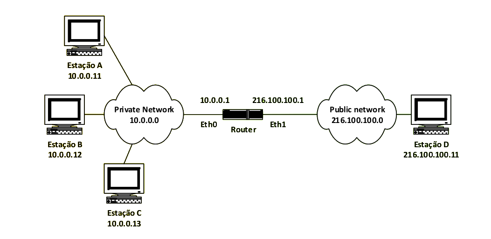

# NAT
- `NEtwork Address Translation`
- efetua a tradução entre endereços privados e endereços públicos
	- permite mapear endereços privados, internos a uma rede, em endereços públicos, acessíveis através da Internet
- A associação entre endereços públicos e privados pode ser:
	- **estática**
	- **dinâmica**
- Os endereços `NAT` são **endereços privados**
	- Os pacotes enviados para estes destinos não são reencaminhados para as redes públicas
	- O BGP não anuncia estes endereços
	- RIP e OSPF sim

## Associação Estática
- O mapeamento entre endereços `NAT` e endereços públicos é configurada estaticamente no router
- Permite que sejam iniciadas sessões nas duas direções

## Associação Dinâmica
- O mapeamento entre endereços `NAT` e endereços públicos é efetuada automaticamente quando o primeiro pacote privado chega ao router NAT

## Address Blocks

Prefix             Endereço Mínimo        Endereço Máximo
--------------  --------------------   --------------------
10/8               10.0.0.0              10.255.255.255
172.16/12          172.16.0.0            172.31.255.255
192.168/16         192.168.0.0           192.168.255.255
169.254/16         169.254.0.0           169.254.255.255

: Endereços NAT

## Exemplo

Se as estações tentarem fazer ping, acontece o seguinte:

\begin{figure}
\centering
\subfloat[Ping de $10.0.0.13$ para $216.100.100.11$. \textit{Snipping} da rede Interna]{\includegraphics[width=0.48\textwidth]{../pictures/nat_private_ping_1.png}}
\subfloat[Ping de $10.0.0.13$ para $216.100.100.11$. \textit{Snipping} da rede Externa]{\includegraphics[width=0.48\textwidth]{../pictures/nat_public_ping_1.png}} \\
\subfloat[Ping de $10.0.0.12$ para $216.100.100.11$. \textit{Snipping} da rede Interna]{\includegraphics[width=0.48\textwidth]{../pictures/nat_private_ping_2.png}}
\subfloat[Ping de $10.0.0.12$ para $216.100.100.11$. \textit{Snipping} da rede Externa]{\includegraphics[width=0.48\textwidth]{../pictures/nat_public_ping_2.png}}\\
\subfloat[\label{fig:nat_error} Ping de $10.0.0.11$ para $216.100.100.11$. \textit{Snipping} da rede Interna]{\includegraphics[width=0.48\textwidth]{../pictures/nat_private_ping_3.png}}\\
\caption{Exemplo de ping de estações numa rede interna para uma estação na rede externa e tradução de endereços NAT privados em endereços públicos. A figura \ref{fig:nat_error} mostra o que acontece quando o router não possui mais endereços públicos para os quais possa transferir o endereço NAT privado.}
\label{}
\end{figure}

O router possui um número fixo de endereços públicos, por isso é que a estação `10.0.0.11` não consegue aceder à rede pública porque todos os endereços públicos disponíveis estão a ser utilizados por outras máquinas. 

As associações entre endereços privados e endereços públicos possuem um tempo máximo de vida (`timeout`), que no caso de inatividade de uma estação, garante a desassociação do endereço e respetiva libertação.
